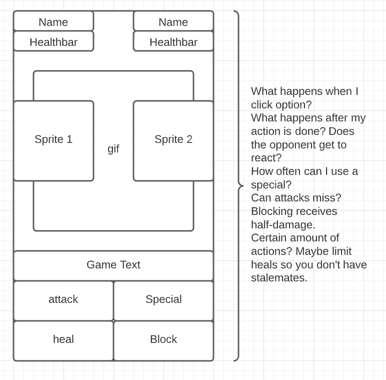
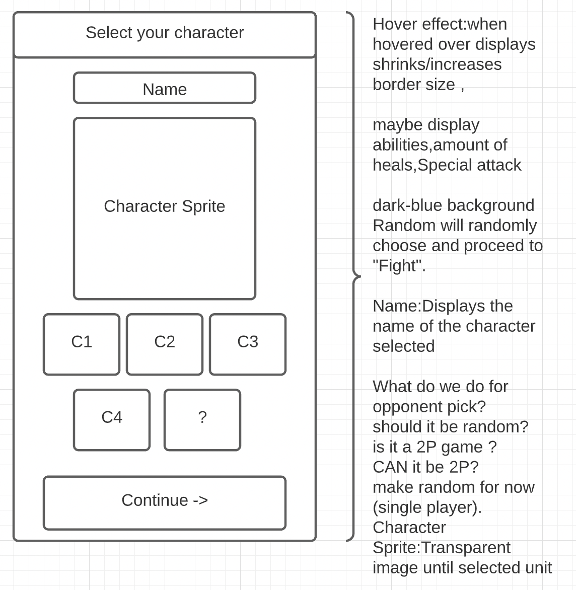

# FF Fight (FFF)

a turn-base fighting game
Inspired by Final Fantasy 
users can select their fighter
User can select from a set of abilities
First one to reach 0 health loses

## Wireframes

**Mobile Fight Layout**

**Mobile Select Layout**

Wireframes Wireframes showing your app's layout on desktop, tablet, and mobile. These can be as lo-fi or as hi-fi as you want. You can either to put these in the README or upload them to your repository.

## API

I will be using the Tenor GIF API to grab animations for the action scenes of each attack.

[https://tenor.com/gifapi/documentation#quickstart-setup](https://tenor.com/gifapi/documentation#quickstart-setup)

API What API you want to use and what information you want to get from it.

## Features

* Fight screen with 2 sprites, 4 different abilities , battle music and animations from TenorGIF.
* A Character Select Screen of 4 different playable characters
* Use at least 1 media queries with 2 screen sizes.

## Stretch Goals

* A Main Menu, introducing you to the mechanics of the game with the "How to play" bar and starting up the game, Music can also be turned off here
* Look into localstorage so you can save data to the user's browser
* Add a second API
* Add creative use of event listeners and UI interaction(CSS animations and transitions)

Stretch goals Stretch goals for additional / advanced features for when you complete your MVP.

## Link

surge URL

## Notes
Technical Demonstration
All projects will be presented to the class. Your presentation should:

* Be no longer than 5 minutes in length
* Show off all features of the app
* Explain the technical details
* Explain the technical challenges
* Explain which improvements you might make

